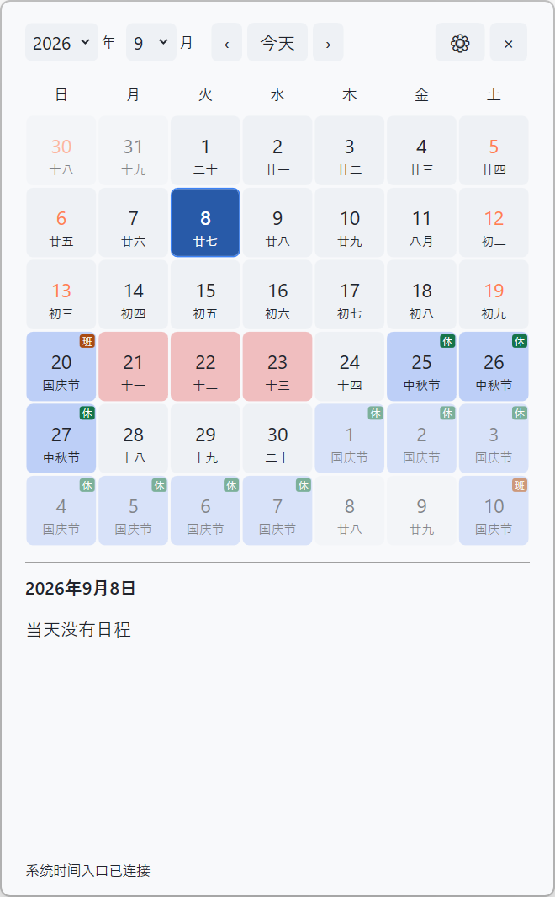
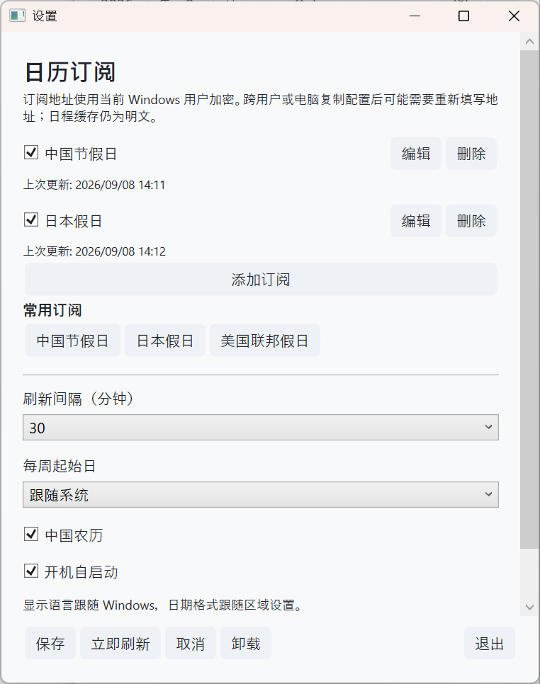

# WinCalendar

[简体中文](README.md) | [English](README.en.md) | [繁體中文](README.zh-TW.md) | [日本語](README.ja.md)

點擊 Windows 右下角時間，查看日曆、假日和行程。

**[下載最新版本](https://github.com/houjie1212/WinCalendar/releases/latest)** · [回報問題](https://github.com/houjie1212/WinCalendar/issues)

適用於 Windows 11 x64，無需額外安裝執行環境。不同 Windows 版本的驗證情況請見[開發說明（簡體中文）](docs/development.md#兼容与验证)。

- **安裝版（推薦）**：下載 `WinCalendar-Setup-版本號-x64.exe`，依照提示安裝。
- **免安裝版**：下載 `WinCalendar-版本號-win-x64.zip`，完整解壓縮後執行 `WinCalendar.exe`，請保留整個資料夾。

Windows 可能顯示未知發行者提示，目前安裝程式尚未簽署。請從上方發行頁下載。

## 主要功能

- **假日與休班**：新增相容的中國節假日訂閱，查看節日名稱和「休／班」標示。
- **可選農曆**：在設定中開啟中國農曆，與日曆一起顯示。
- **日曆訂閱**：提供中國、日本、美國假日快捷選項，也可新增自己的日曆訂閱連結。
- **顏色區分**：用不同背景色區分訂閱，同一天最多顯示三種顏色，完整行程仍可查看。
- **快速切換月份**：支援年月下拉選單、左右按鈕和滑鼠滾輪，點擊「今天」返回當天。
- **跟隨系統**：自動適應淺色與深色主題，支援簡體中文、繁體中文、英文和日文。

## 畫面預覽

### 主畫面

以下為簡體中文介面，展示啟用節假日訂閱和中國農曆後的效果，不代表預設設定。

### 設定畫面

## 快速開始

1. 安裝並啟動 WinCalendar；若正在使用其他工作列日曆工具，請先結束。
2. 點擊右下角系統時間開啟日曆。再次點擊、點擊面板外部或按 Esc 即可收起。
3. 點擊齒輪開啟設定，選擇常用訂閱，或透過「新增訂閱」填入自己的連結。
4. 儲存訂閱編輯視窗後，再點擊設定頁的「儲存」。需要農曆或開機啟動時，可在這裡開啟。

## 常見問題

### 為什麼沒有節假日和農曆？

預設不新增任何訂閱，農曆也預設關閉。在設定中新增並啟用「中國節假日」常用訂閱後，就能顯示對應假日和休班標示；自訂連結需要選擇「中國節假日」類型，且來源格式相容。農曆需另外開啟。

一般日曆訂閱會顯示行程和顏色，不會產生中國休班標示。訂閱中的標題、地點和描述保留原文。

### 訂閱多久更新？失敗了怎麼辦？

預設每 30 分鐘更新，可在設定中調整。「立即重新整理」會先儲存設定，再取得最新行程；失敗時保留已下載的行程。

僅支援可直接存取的公開網路日曆連結，內部網路或依賴代理伺服器的訂閱無法更新。請檢查網路和連結是否可用。程式只讀取日曆，不修改原本的行程，也不提供帳號登入。

### 如何更新？

在設定中點擊「檢查更新」，有新版本時依照提示更新並重新啟動。程式不會自動檢查或下載更新；尚未儲存的設定需要先儲存。

如果更新失敗，可從發行頁下載新版安裝程式覆蓋安裝，保留原有設定和訂閱。

### 如何結束或解除安裝？

在設定中點擊「結束」，系統時間會恢復原本的開啟方式。開機啟動預設關閉，可在設定中開啟。

安裝版可透過設定中的「解除安裝」，或 Windows 的「已安裝的應用程式」移除。**解除安裝預設會刪除訂閱、設定及已下載的資料**；需要保留時，請勾選保留訂閱與設定的選項。取消解除安裝不會刪除資料。

### 資料儲存在哪裡？

設定和已下載的行程儲存在本機的 `%LOCALAPPDATA%\WinCalendar` 資料夾。

訂閱位址會加密儲存，更換電腦或 Windows 帳戶後可能需要重新填寫；已下載的行程未加密，請勿直接分享整個資料夾。這種保護無法阻止已控制目前帳戶的程式讀取資料。

## 回饋與開發

遇到問題或有功能建議，歡迎[提交回饋](https://github.com/houjie1212/WinCalendar/issues)。請提供 Windows 版本、程式版本和操作步驟，截圖時避開私人訂閱連結。

以下文件目前以簡體中文提供：

- [開發說明](docs/development.md)：建置、檢查、訂閱規則與更新復原。
- [安裝程式說明](Installer/README.md)：安裝、解除安裝與封裝。
- [驗證記錄](QA.md)：已檢查的項目與待驗證情境。
- [第三方授權說明](THIRD-PARTY-NOTICES.md)。
